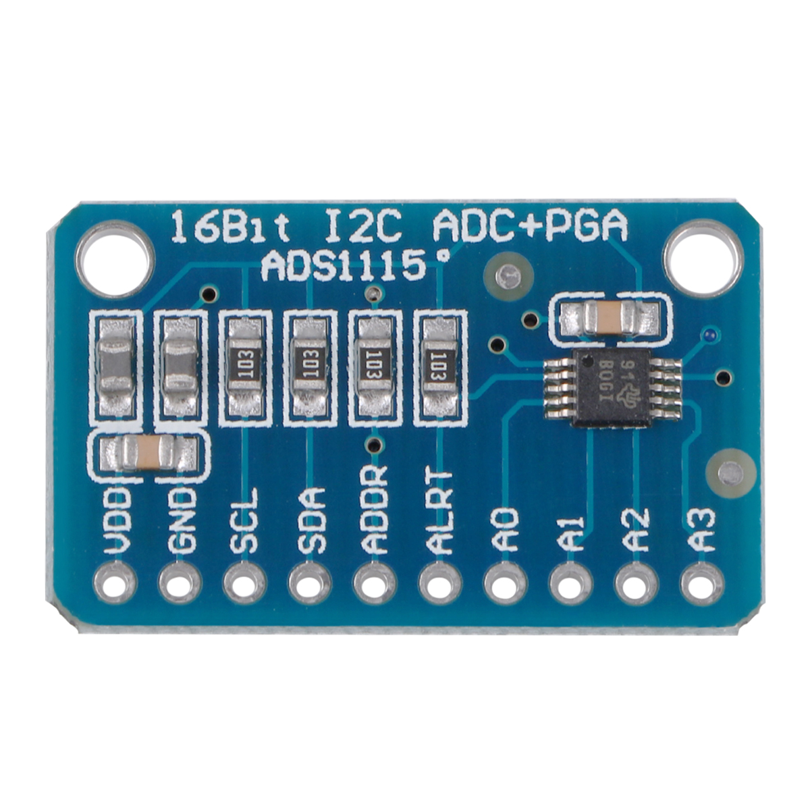

# Data acquisition with the ADS1115 on the Raspberry PI with callback handlers



The ADS1115 is a sigma delta converter which has a PGA and a
programmable sampling rate from 8Hz..860Hz. It's perfect for slowly
changing inputs such as pressure, temperature, heart rate etc.

This repo offers the class `ADS1115rpi` which manages the
communication between the ADS1115 and the client who just needs to
implement the callback `hasSample(float sample)` which is then called
at the requested sampling rate.

*The class uses the ALERT/RDY pin of the ADS1115 connected to GPIO 17
to establish the sampling rate.* Without this connection this driver
won't work. The ALERT/RDY pin wakes up a thread when a sample is available
which then calls the callback interface with the sample value.

## Prerequisites

    apt-get install cmake
    apt-get install libgpiod-dev


## Building:

To build:

    cmake .

    make

## Install

    sudo make install

## Usage examples

Data printer: In the subdir `example` is a simple application which prints
the ADC data to the screen or you can pipe it into a file.

    cd example
    ./ads1115_printer

Data plotter: In the subdir `qwt-plot` is a simple QT plotting application.

## General usage

The online doc is here: https://berndporr.github.io/rpi_ads1115/

You need to register a function:
```
void(float);
```
at `registerCallback(f)` which then receives the voltage readings at the
requested sampling rate. If you want to call another method in another
class you can use a lamda function.

### Start the data acquisition:
```
myAD7705comm.start(settings)
```

### Receiving data
Once `start` has been called `hasSample` will be called at the
specified sampling rate.

You can switch to another channel inside the callback handler by
calling `setChannel (ADS1115settings::Input channel)` and then cycle
through the channels. You might need to let the ADC settle to the
next channel so it's recommended to read every channel twice and
then discard the 1st callback event after having switched the channel.

### Stop the data acquisition:
```
myAD7705comm.stop();
```

## Author: Bernd Porr

   - bernd.porr@glasgow.ac.uk
   - mail@berndporr.me.uk
   - www.berndporr.me.uk
