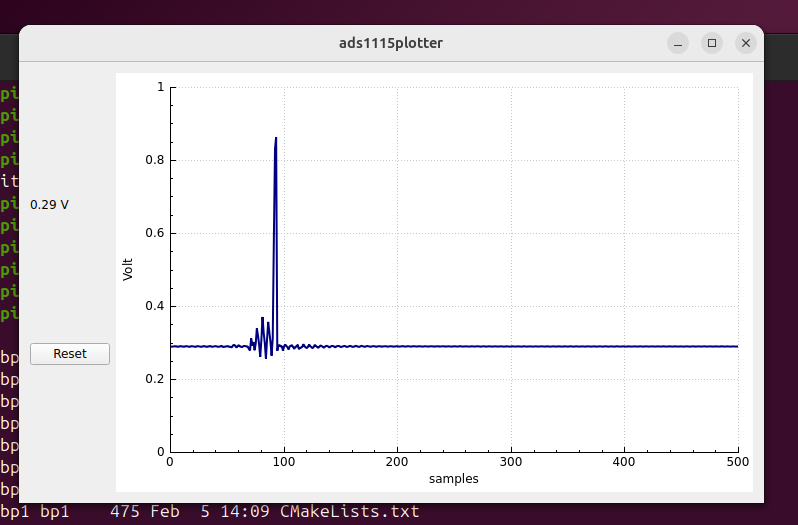

# QT ADS1115 plotter



## Required packages

Install the QT6 and Qcustomplot development packages:

```
apt-get install qt6-base-dev
apt-get install libqcustomplot-dev
```

Make sure that you have installed the ads1115 library (i.e. `sudo make install`) in `/usr/local`.

## Build it

```
cmake .
make
```

## Run it

```
./ads1115plotter
```
